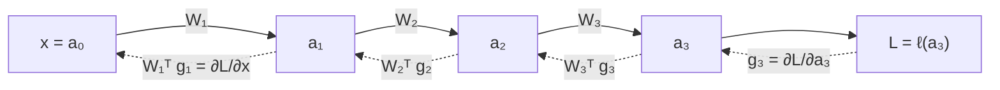

# ai theory

## Derivatives & Jacobians

with $\delta \rightarrow 0$:

$$
f(x + \delta) = f(x) + f'(x) \cdot \delta
$$

approximate a local function behavior: how the function behaves after a small nudge $\delta$

since with NN we go from $\mathbb{R} \rightarrow \mathbb{R}$ space, to $\mathbb{R}^n \rightarrow \mathbb{R}^m$, we must use *Jacobians* (holding derivatives for every outputs $\leftrightarrow$ inputs)

$$
J[i, j] = \frac{df_i}{dx_j}
$$

- rows = outputs -> each row, tell us how output $i$ respond to all the inputs
- columns = inputs -> each column, tell us how input $j$ respond to all the outputs

## Backward Pass

composed of two sibling operations:
- gradients passing
- gradients for optimizing

taken layers $l_k$ and $l_{k-1}$:

$$
g_{k-1} = (\frac{dy}{dx})^T g_k = W^T g_k
$$
to pass the gradient backward

and at the same time we do:

$$
g_{\text{update}} = g_k (\frac{dy}{dW})^T = g_k x^T
$$

to calculate the gradient used during optimization phase: $W \leftarrow W - \eta \cdot g_{\text{update}}$

### Chain rule

If we do the backward pass on $k$ layers, the operations above, stacked together lead to the *chain-rule* $\frac{dL}{dW}$
 

## Activations vs Gradients

- **Activations**: input -> output, forward pass, matmul
- **Gradients**: output -> input, backward pass, chain rule

## Regularization vs Normalization

- **Regularization**: prevent model overfitting, *regularize it* (dropout, weight decay)
    - funny note: dropout has been dropped out from modern LLM, because it was originally used to not make the model overfit on **smaller datasets** -> a lot of epochs, model saw training examples a lot of times, leading to overfitting. But now with frontier pretraining, the epochs are fewer but much bigger datasets
- **Normalization**: matmul can make activations grow or shrink, so it's better to normalize them and keeping them stable, to prevent the gradient go fiuuuu or booom.

## Transformer

[[formulas#Attention]]

[[https://arxiv.org/abs/1706.03762|Attention Is All You Need]]

## RoPE

Attention is *permutation invariant* (e.g. position 1 and position 69 are "the same"), that means the position of the token is not taken in count by attention mechanism.

The original Transformer paper used to sum a *positional encoding* embedding to the word embedding, mixing semantic with positional informations (bad).

Some strategies to encode positional informations directly into the attention mechanism have been tried, but the best one is *RoPE (Rotational Positional Embeddings)*.

### wtf?

I think this is actually the most used word after glancing at RoPE.

[[formulas#RoPE]]

> The $q, k$ heads, individually, get paired up two by two ($\frac{d_{\text{head}}}{2}$) and each pair is rotated by *frequency*: $\theta_i = base^{\frac{-2i}{d_{\text{head}}}}$ via the rotation matrix $R$

- It's a dot product because we don't want to mix stuffs (with a sum), but instead measure how well a tuple of tokens "align" (thanks to the angle)
- Applied to $Q,K$ because they are responsible for information routing, and we want to act on routing not on information meaning
- Even though each have an *absolute* position (let's say $m$ and $n$), thanks to being *orthogonal*, we can just look for the *relative* position $(n - m)$. 
- It's important to differentiate between $q/k$ pairs and *token pairs*. $q/k$ pairs are pair of dimensions in the same token.
- We work on pairs interleaved: $(q_i, q_{i+1})$ or other convention: $(q_i, q_{i+\frac{d}{2}})$ (same with $k$), so we can actually rotate the vector (otherwise we would be unable to do so on a 1D vector)
- The frequency varies based on the token's pair positions: taken $t_m$ and $t_n$ with positions $m,n$, then each $q/k$ pair shift $\Delta \cdot \theta_i$, where $\Delta$ is the deciding factor for the phase (how much each pair has rotated): <- *need to revise/explore this a bit more, but for now g2g*
    - $\Delta$ high (far-apart tokens): the fast pairs have wrapped, so the \textbf{slow} pairs carry the clean positional signal.
    - $\Delta$ low (nearby tokens): the fast pairs give a large, sharp phase difference, cleanly differentiating neighbors (slow pairs barely move).

