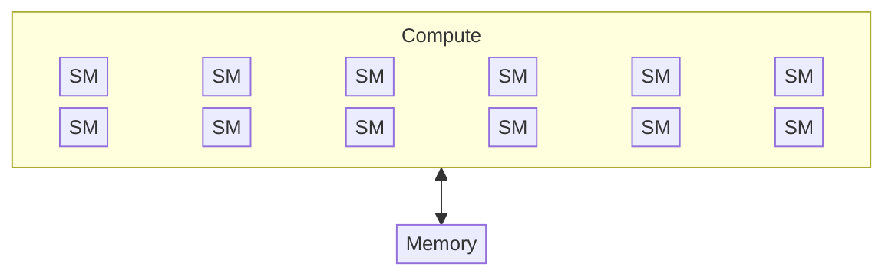

# estimates



to compute things, there must be a `memory -> accelerator (compute) -> memory` back-and-forth communication

- accelerator speed: **FLOP/s**
- memory bandwidth: **bytes/s**

## FLOPs

- $\text{FLOP}$: floating point operation (basic addition, multiplication and such)
- $\text{FLOPs}$*: floating point operations (measure of computation done)
- $\text{FLOP/s}$: floating point operations per second used to measure hardware (<u>depends heavily on the data type</u>)

for example:

- training GPT-3 took $3.14e23 \space \text{FLOPs}$
- training GPT-4 is speculated to take $2e25 \space \text{FLOPs}$
- **H100** has a peak performance of $1979 \space \text{teraFLOP/s}$ on sparse matrix, half with dense matrix.

>[!note]
>generally, the MFU (*Model FLOPs utilization*) is added in the calculation for a more precise per-second calculation: 
>
>`mfu = actual_flop_per_sec / promised_flop_per_sec` with `promised_flop_per_sec` dependent on `dtype` and the model (present in the GPU spec sheet; B200 >> H100, bf16 >> fp32)
>
> ...and additional note (inside the note): because of memory bottlenecks, the MFU is usually ~0.5, calculated with `mfu = min(1, arithmetic_intensity / accelerator_intensity)`

in general, number of FLOPs in transformers, can be 'approximated' by calculating the time in matmul operations

taken $(B, N, D)$, with $B$ batch dim (*num of data points*), $N$ input dim and $D$ hidden dim (*number of parameters*), for a forward pass on a single layer, the cost is:

$$2 * B * N * D$$ 

*(backward pass is 2x expensive than forward pass)*

>[!note]
> this is where the **6ND** rule to calculate flops come from:
> forward pass: 2 + backward pass: 4 = 6

### Calculating training time

e.g. *how long it would take to train a 70B model on 15T tokens, on 1024 H100s?*

```python
total_flops = 6 * 70e9 * 15e12 # 6ND rule for transformers
h100_flop_per_sec = 1979e12 / 2 # (dense is 50%, as per spec)
mfu = 0.5
flops_per_day = h100_flop_per_sec * mfu * 1024 * (60 * 60 * 24)
days = total_flops / flops_per_day
```

## Intensity and Boundness

- arithmetic intensity >> gpu accelerator intensity -> **compute bound** -> training, because we load the big matrix at once (per transformer design) and saturate the accelerator
- arithmetic intensity << gpu accelerator intensity -> **memory bound** -> inference, because we spit tokens one at a time

>[!note]
> in general we'll be memory bound, so higher arithmetic intensity is good!

### arithmetic intensity

`arithmetic_intensity = flops / bytes_moved`

### gpu accelerator intensity

`h100_accelerator_intensity = h100_flop_per_sec / h100_bytes_per_sec`

