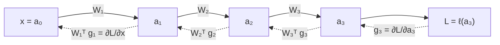

# theory

## Basics

### Derivatives & Jacobians

with $\delta \rightarrow 0$:

$$
f(x + \delta) = f(x) + f'(x) \cdot \delta
$$

approximate a local function behavior: how the function behaves after a small nudge $\delta$

since with NN we go from $\mathbb{R} \rightarrow \mathbb{R}$ space, to $\mathbb{R}^n \rightarrow \mathbb{R}^m$, we must use *Jacobians* (holding derivatives for every outputs $\leftrightarrow$ inputs)

$$
J[i, j] = \frac{df_i}{dx_j}
$$

- rows = outputs -> each row, tell us how output $i$ respond to all the inputs
- columns = inputs -> each column, tell us how input $j$ respond to all the outputs

### Training process

it consists of performing a backward pass after a forward pass

why after a forward pass? because forward pass will calculate predictions (and the loss) used in backward pass to update the weights, with chain rule (backprop, compute gradients) and gradient descent (uses gradients to update weights):

$$
\theta \leftarrow \theta - \eta \nabla_{\theta} L
$$

with $\theta$ model parameters, $\eta$ learning rate and $L$ loss

*loss*? not the meme |_ 

it's a function that measures how much the current predictions are different from the ground truth outputs

the common one is [[formulas#Cross-entropy loss]]

#### Entropy and such

*surprise* (a.k.a. self-information) of an event $s$ is just how unexpected it is.

$$
h(s) = \log \frac{1}{p_s} = -\log p_s
$$

```surprise
```

entropy comes from surprise and probability distribution

$$
H = \sum_s p_s h(s)
$$

usually we don't have the ground truth probability distribution for a problem, instead we have an approximate one given by some *model* (**spoiler**: in our case is the LLM!)

if model probability distribution belief is a lot different than the ground truth one, then the average surprise is high and this is calculated via **cross-entropy**


<small>Reference: <a href="https://www.youtube.com/watch?v=KHVR587oW8I&t=1465s">The Key Equation Behind Probability (YouTube)</a></small>

### Backward Pass

composed of two sibling operations:
- gradients passing
- gradients for optimizing

taken layers $l_k$ and $l_{k-1}$:

$$
g_{k-1} = (\frac{dy}{dx})^T g_k = W^T g_k
$$
to pass the gradient backward

and at the same time we do:

$$
g_{\text{update}} = g_k (\frac{dy}{dW})^T = g_k x^T
$$

to calculate the gradient used during optimization phase: $W \leftarrow W - \eta \cdot g_{\text{update}}$

### Chain rule

If we do the backward pass on $k$ layers, the operations above, stacked together lead to the *chain-rule* $\frac{dL}{dW}$
 


### Activations vs Gradients

- **Activations**: input -> output, forward pass, matmul
- **Gradients**: output -> input, backward pass, chain rule

### Regularization vs Normalization

- **Regularization**: prevent model overfitting, *regularize it* (dropout, weight decay)
    - funny note: dropout has been dropped out from modern LLM, because it was originally used to not make the model overfit on **smaller datasets** -> a lot of epochs, model saw training examples a lot of times, leading to overfitting. But now with frontier pretraining, the epochs are fewer but much bigger datasets
- **Normalization**: matmul can make activations grow or shrink, so it's better to normalize them and keeping them stable, to prevent the gradient go fiuuuu or booom.

### Tokenizer

a tokenizer is composed of a round-trip constructed as follows:
- `encode()` -> convert string into tokens (vocabulary indices) 
- `decode()` -> convert tokens back into the string

other than making strings to be computable by the LLM, it also introduces *compression*, useful for fitting more tokens in the same context window!

we'll not use a char-level/single byte-level tokenizer (no compression), instead, nowadays a *byte-pair (BPE)* tokenizer is often used ([tiktoken by openai](https://github.com/openai/tiktoken))

larger the *compression ratio*, the better it is: `compression_ratio() = bytes(token) / num_tokens`

to increase compression we need to increase the `vocab_size`...why? because if we encounter frequently the same multi-character chunk, that chunk will be represented by one token, as an optimization! but instead if the vocab budget is limited, and we don't have repetitions of chunks, then spending a token for a chunk like this is wasteful and instead what we do is split the chunk in smaller pieces -> incrementing the num of tokens.

#### BPE Tokenizer

byte-pair encoding is used to have an efficient subword-level tokenization

> common sequences of bytes are represented by a single token, rare sequences are represented by many tokens

a **pre-tokenizer** is used to optimize the BPE tokenization:
- avoiding contamination (e.g. dog! vs dog. , the adjacent bytes differs by punctuation. with pre-tokenization, we'll chunk the text via some heuristic, and we'll get 'dog', '!', '.' as different chunks, then merging will be allowed only per-chunk and thanks to this we'll have 'dog' and '!/.' as different adjacent bytes) 
- avoiding a full pass over text corpus for every merge (when we split in chunks, we compute a chunk <-> count mapping (smaller than whole text corpus), that will be consulted every merge)

regex-based is the most used pre-tokenizer: [from tiktoken](https://github.com/openai/tiktoken/pull/234/changes)

after pre-tokenization, we must **merge** the highest frequency adjacent pair of tokens, where every occurrence of the same most frequent pair is merged (n-merges times) and become one single token:
- this token will be added to the vocabulary (together with the already existing 'base' tokens e.g. in UTF-8 the base vocabulary is composed of 0-255 bytes)
- the merge procedure will produce an **ordered merges list** that will be constructed during *training* and used when calling `encode()` on new text!
    - why *ordered*? because we'll exactly follow the same construction graph as per training, on the new word, by scanning for same adjacent pairs by following earliest-highest priority and merging, so we avoid losing precious pairs! e.g for "lower" and "lowest": 'l' + 'o' -> 'lo', 'w' + 'e' -> 'we' and then finally 'lo' + 'we' -> 'lowe'
- n-merges, in case of byte-level BPE, is = `target_vocab_size - 256 - num_of_special_tokens`

> [!note]
> to break ties between pairs, lexicographically greater pair ( `ord('b') > ord('a')` ) is the one picked.

some notes based on implementation exercise:
- handle everything as `str` and only convert into `bytes` when needed (we can do this easily thanks to this beautiful concept of *UTF-8 bytes representation*)
- special tokens must be treated as standalone full tokens without splitting them in bytes (in encoding)
- when special tokens are overlapping e.g. `special_tokens = <|endoftext|>, <|endoftext|><|endoftext|>`, we must prefer the longest one during regex matching (to disambiguate)

## fp32 vs fp16 vs bf16

| Format | Sign bits | Exponent bits | Mantissa bits | Main property |
|---|---:|---:|---:|---|
| fp32 | 1 | 8 | 23 | large range, high precision; high memory usage|
| fp16 | 1 | 5 | 10 | limited range, decent precision |
| bf16 | 1 | 8 | 7 | large range, lower precision; good to avoid underflow/overflow during training |

but in reality *mixed precision training* is used, to balance between memory and stabilization: 
- fp32 for optimizer states (so training is stable)
- bf16 for parameters, activations and gradients

there also exists some funny ones like *nvfp4* by NVIDIA, which is basically fp4 and we can actually list the values: 

`0, ±0.5, ±1, ±1.5, ±2, ±3, ±4, ±6`

but these values are bundled with a *scale factor* to produce the actual value 

(will explore more later on...)

## Transformer

<div style="display:flex; align-items:center; gap:1.5rem; flex-wrap:wrap; margin:1.2rem 0;">


</div>

[[formulas#Self-Attention]]

[[https://arxiv.org/abs/1706.03762|Attention Is All You Need]]

### Pre-norm vs Post-norm

historically post-norm was used, so a layer norm after each transformer block in the residual stream

some guy in 2020 found out that having the layer norm outside of the residual stream AND at the start of each operation in the transformer block:
- removed the need of lr warmup
- made the training more stable because the gradients at init of every layer are 'clean' (since the residual stream is just passing the input identity)

>[!note]
> i prefer to /s/post-norm/residual-norm because it actually lives on the residual stream
>
> whereas today, it's commmon to put layer norm pre / post operation in the transformer block (those are the actual pre/post norm)

### Why RMSNorm over LayerNorm

well, *RMSNorm* is just as good as LayerNorm (sometimes even better) without having to take in count extra parameters...free optimization!

this leads to less memory movement -> that means we can keep our GPUs busy with matmul instead of side operations

>[!note]
> normalization work involve really low amount of flop % compared to tensor operations, but during runtime, depending on setup, memory movement and such, it can take up to 25.5% of runtime.
>
> so even if it feels a small optimization, it will save quite a bit of performance...the same applies to why bias is dropped in modern transformer!

### Learning rate schedule & Gradient clipping

learning rate usually needs to warmup, then starts high and slowly go down 

to do so, a *schedule* is used (e.g cosine schedule) that will tell for each training iteration, what the learning rate should become

other than this, another neat technique to optimize training and gradients is called *gradient clipping*, where a limit on the norm (the magnitude, via sqrt an ^2) of the gradient is enforced after each backward pass to avoid large gradients

### Hyperparameters consensus

#### $d_\text{ff} / d_\text{model}$ ratio

[[https://arxiv.org/abs/2001.08361|Scaling Laws for Neural Language Models]]

the optimal size for the dimension of the first feed forward network is $d_{\text{ff}} = 4d_{\text{model}}$ (and everyone, boringly, agrees to this)

- T5 from google took a more system-oriented approach where basically they chose a 64 ratio, just because: bigger matrix, better it is on GPU consumption (worked fine)

#### $d_\text{head} \times \text{num\_heads} \approx d_\text{model}$

here we reshape the heads $Q, K, V$ this way: 

$$
\text{seq\_len} \times d_\text{model} \rightarrow \text{seq\_len} \times \text{num\_heads} \times d_\text{head}
$$

- the computational cost remains the same
- the parameter count stay controlled

so why we do this? <u>because empirically, it works well</u>

#### Aspect ratio

$$d_\text{model} / \text{num\_layers}$$

the normal consensus on this ratio is around 100 - 150

mostly a ratio for good expressiveness and good system compatibility (e.g. if it's too deep and not wide, we would need a lot of GPUs without fully using tensor parallelism benefits...wasteful)

### softmax is dangerous

wherever we see softmax, so exponentiation, there is high probability that it can either blow up or vanish. 

we say that: *"it is sensitive to the scale of its inputs"* and to handle this, we must be sure that the input is normalized

e.g. in attention, to guard the softmax, initially the transformer original paper introduced $1/\sqrt{d_k}$ but recently there is also extra normalization right after computing $Q, K$ and before multiplying with $V$ -> called *QK norm*

### Attention 

#### heads variations


#### alternatives for optimization

>[!note]
> what is done in the industry is that these attention alternatives are combined with the normal attention (e.g. Nemotron 3 with Mamba 2 and normal attention)

- **Linear attention**

instead of $Attn(Q,K,V) = \rho(QK^T)V$ quadratic complexity $(n^2d_k)$, if we ignore $\rho$ we can actually have a linear complexity:

$$
(QK^T)V = Q(K^TV)
$$

thanks to this simple matrix multiplication associative rule, we get to $2nd_vd_k$

But for inference, we can use a clever formulation...we can think about combining this linear attention to the concept of RNN, where we shape the calculation this way:

$$
S_t = S_{t-1} + k_t v_t^T \space \text{and} \space y_t = q_t^TS_t
$$

in this way we don't need to store KV and compute that for every token in output, since we can just look at the previous *state*!

>[!note]
> the key to calculate matmul complexity is to square the contracted dimension if equal or add to multiplication if not equal
>
> e.g. $QK^T \space (n \times d_k)(n \times d_k) \rightarrow O(n^2 \cdot d_k)$
>
> $K^TV \space (d_k \times n)(n \times d_v) \rightarrow O(n \cdot d_k \cdot d_v)$ because $n$ is contracted

- **Mamba 2**

taken the RNN formulation above, it can be modified with a *gate*, depending only on input, as follows, used to decaying older informations (act on previous state):

$$
S_t = \gamma_t S_{t-1} + k_t v_t^T \space \text{with} \space \gamma_t = f(x_t) \space \text{and} \space 0 \leq \gamma \leq 1
$$

[[https://arxiv.org/abs/2405.21060|Transformers are SSMs: Generalized Models and Efficient Algorithms Through Structured State Space Duality]]

- **Gated delta net**

augmentation of Mamba 2, where here we add an extra gate on the current state:

$$
S_t = \gamma_t (I - \beta_tk_tk_t^T) S_{t-1} + \beta_t k_t v_t^T \space \text{with} \space \gamma_t = f(x_t)
$$

need to explore and go deep more on these...

### RoPE

Attention is *permutation invariant* (e.g. position 1 and position 69 are "the same"), that means the position of the token is not taken in count by attention mechanism.

The original Transformer paper used to sum a *positional encoding* embedding to the word embedding, mixing semantic with positional informations (bad).

Some strategies to encode positional informations directly into the attention mechanism have been tried, but the best one is *RoPE (Rotational Positional Embeddings)*.

#### wtf?

I think this is actually the most used word after glancing at RoPE.

[[formulas#RoPE]]

> The $q, k$ heads, individually, get paired up two by two ($\frac{d_{\text{head}}}{2}$) and each pair is rotated by *frequency*: $\theta_i = base^{\frac{-2i}{d_{\text{head}}}}$ via the rotation matrix $R$

- It's a dot product because we don't want to mix stuffs (with a sum), but instead measure how well a tuple of tokens "align" (thanks to the angle)
- Applied to $Q,K$ because they are responsible for information routing, and we want to act on routing not on information meaning
- Even though each have an *absolute* position (let's say $m$ and $n$), thanks to being *orthogonal*, we can just look for the *relative* position $(n - m)$. 
- It's important to differentiate between $q/k$ pairs and *token pairs*. $q/k$ pairs are pair of dimensions in the same token.
- We work on pairs interleaved: $(q_i, q_{i+1})$ or other convention: $(q_i, q_{i+\frac{d}{2}})$ (same with $k$), so we can actually rotate the vector (otherwise we would be unable to do so on a 1D vector)
- The frequency varies based on the token's pair positions: taken $t_m$ and $t_n$ with positions $m,n$, then each $q/k$ pair shift $\Delta \cdot \theta_i$, where $\Delta$ is the deciding factor for the phase (how much each pair has rotated): <- *need to revise/explore this a bit more, but for now g2g*
    - $\Delta$ high (far-apart tokens): the fast pairs have wrapped, so the slow pairs carry the clean positional signal.
    - $\Delta$ low (nearby tokens): the fast pairs give a large, sharp phase difference, cleanly differentiating neighbors (slow pairs barely move).

## Continual learning and In-context learning

### Continual learning

improve the model, after training and deployment, based on real requests feedback and knowledge, by updating the weights (without the need of pretraining a base model from scratch)

e.g. 
- Cursor with Tab model, gets around 400k+ user samples a day, so it's really easy to improve the model with *meaningful* data
- the various Sonnet models 

### In-context learning

it's more *adapting* than learning, since it will gain knowledge by informations present in its context, without updating weights

so **if** we end up getting an infinite context window, this will work pretty well :')

> [!note]
> this will not improve model reasoning ability...it will just give access to more informations

## Sparsity

so this is basically a way to save up resources without sacrifying quality (or even improving it!)

### MoE (Mixture of Experts)

this allow to have a bigger model (more parameters) but without overhead cost (we use only a subset of those)

> router -> multiple FFNs -> ffn $\in$ FFNs activated every forward/backward pass

increasing model size is shown to improve performance

### DSA (Deepseek Sparse Attention)

this is an architectural change for attention, where we try to introduce sparsity to save resources

adding sparsity here is not easy like in MoE. In MoE we are fine with *trial-and-error*, we are just *classifying* a FFN for a specific token and also with load balancing strategies this is a lot less of an issue

but in attention, we are talking about information and we can't do trial and error on this, since it can end up losing that information forever

> indexer -> QK^T -> k $\in$ QK chosen -> more efficient QK calculation

the indexer will only retrieve some candidates keys that then will be used to compute $QK^T$

the retrieved keys get an "approximated" relevance, because to get the real relevance for that query, we should compute the full attention x)

## Distillation

...

### OPSD (On Policy Self Distillation)

<small>Reference: <a href="https://www.youtube.com/watch?v=wxOZWD6wYVY">Sasha Rush Dwarkesh OPSD explanation</a></small>

